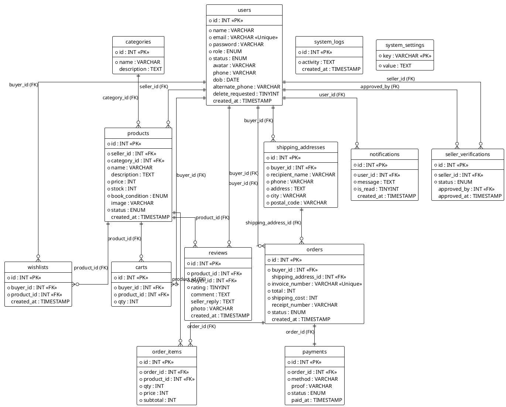

# Skema Database (Database Schema) - RubbyBooks

Database dirancang dengan skema relasional yang terdiri dari lebih dari 8 tabel wajib (total ada 14 tabel pendukung).

## 1. Tabel Utama Pengguna & Kategori

### `users`
Tabel yang menampung semua entitas pengguna aplikasi.
- `id` (INT, PK, Auto Increment)
- `name` (VARCHAR)
- `email` (VARCHAR, Unique)
- `password` (VARCHAR, Hashed)
- `role` (ENUM: 'buyer', 'seller', 'admin')
- `status` (ENUM: 'active', 'pending', 'banned', 'suspended')
- `avatar` (VARCHAR)
- `phone` (VARCHAR)
- `dob` (DATE)
- `alternate_phone` (VARCHAR)
- `delete_requested` (TINYINT)
- `created_at` (TIMESTAMP)

### `seller_verifications`
Tabel khusus untuk mengelola proses verifikasi pengguna dengan *role* `seller`.
- `id` (INT, PK)
- `seller_id` (INT, FK -> users.id)
- `status` (ENUM: 'pending', 'approved', 'rejected')
- `approved_by` (INT, FK -> users.id)
- `approved_at` (TIMESTAMP)

### `categories`
Tabel untuk mengelompokkan buku.
- `id` (INT, PK)
- `name` (VARCHAR)
- `description` (TEXT)

## 2. Tabel Produk & Aktivitas Belanja

### `products`
Menampung seluruh katalog buku.
- `id` (INT, PK)
- `seller_id` (INT, FK -> users.id)
- `category_id` (INT, FK -> categories.id)
- `name` (VARCHAR)
- `description` (TEXT)
- `price` (INT)
- `stock` (INT)
- `book_condition` (ENUM: 'new', 'used_good', 'used_fair')
- `image` (VARCHAR)
- `status` (ENUM: 'active', 'inactive')
- `created_at` (TIMESTAMP)

### `wishlists`
Daftar buku favorit pembeli.
- `id` (INT, PK)
- `buyer_id` (INT, FK -> users.id)
- `product_id` (INT, FK -> products.id)
- `created_at` (TIMESTAMP)

### `carts`
Keranjang belanja pembeli.
- `id` (INT, PK)
- `buyer_id` (INT, FK -> users.id)
- `product_id` (INT, FK -> products.id)
- `qty` (INT)

## 3. Tabel Pesanan & Transaksi

### `shipping_addresses`
Alamat pengiriman terkait setiap pesanan.
- `id` (INT, PK)
- `buyer_id` (INT, FK -> users.id)
- `recipient_name` (VARCHAR)
- `phone` (VARCHAR)
- `address` (TEXT)
- `city` (VARCHAR)
- `postal_code` (VARCHAR)

### `orders`
Tabel untuk setiap *checkout* transaksi.
- `id` (INT, PK)
- `buyer_id` (INT, FK -> users.id)
- `shipping_address_id` (INT, FK -> shipping_addresses.id)
- `invoice_number` (VARCHAR, Unique)
- `total` (INT)
- `shipping_cost` (INT)
- `receipt_number` (VARCHAR)
- `status` (ENUM: 'pending', 'paid', 'processing', 'shipped', 'delivered', 'cancelled')
- `created_at` (TIMESTAMP)

### `order_items`
Rincian item/produk dalam sebuah order.
- `id` (INT, PK)
- `order_id` (INT, FK -> orders.id)
- `product_id` (INT, FK -> products.id)
- `qty` (INT)
- `price` (INT)
- `subtotal` (INT)

### `payments`
Tabel pembayaran/upload bukti transfer.
- `id` (INT, PK)
- `order_id` (INT, FK -> orders.id)
- `method` (VARCHAR)
- `proof` (VARCHAR)
- `status` (ENUM: 'waiting', 'accepted', 'rejected')
- `paid_at` (TIMESTAMP)

## 4. Tabel Fitur Pendukung

### `reviews`
Sistem ulasan dan pemberian bintang untuk produk.
- `id` (INT, PK)
- `product_id` (INT, FK -> products.id)
- `buyer_id` (INT, FK -> users.id)
- `rating` (TINYINT)
- `comment` (TEXT)
- `seller_reply` (TEXT)
- `photo` (VARCHAR)
- `created_at` (TIMESTAMP)

### `notifications`
Sistem notifikasi dalam aplikasi (*in-app notification*).
- `id` (INT, PK)
- `user_id` (INT, FK -> users.id)
- `message` (TEXT)
- `is_read` (TINYINT)
- `created_at` (TIMESTAMP)

### `system_logs`
Catatan rekaman aktivitas/log dari pengguna atau sistem.
- `id` (INT, PK)
- `activity` (TEXT)
- `created_at` (TIMESTAMP)

### `system_settings`
Menyimpan konfigurasi pengaturan aplikasi.
- `key` (VARCHAR, PK)
- `value` (TEXT)

## 5. Diagram ERD (PlantUML)

> [!NOTE]
> Jika ekstensi PlantUML Anda memunculkan error *missing @start/@end wrapper* saat melihat berkas Markdown ini, silakan buka dan render langsung berkas standalone [DATABASE_SCHEMA.puml](file:///c:/laragon/www/UAS_INFO2425_NasylaPutriAnjani_202410715173/docs/DATABASE_SCHEMA.puml).

Berikut adalah kode PlantUML untuk merepresentasikan hubungan antar tabel (Entity Relationship Diagram):

